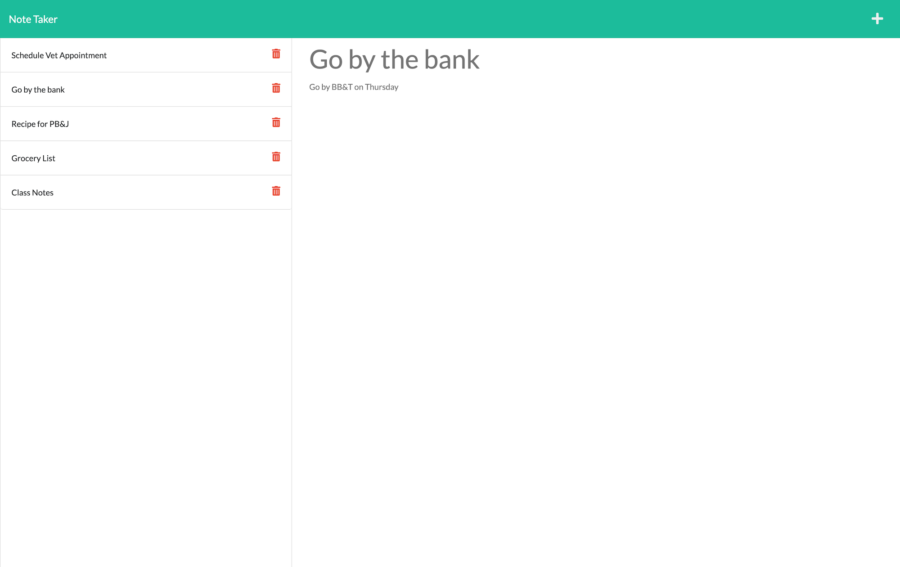

# Note-Taker

  [](https://opensource.org/licenses/ISC)

  ## Description
  I created the Note-Taker Application to keep up with my day-to-day notes so that I can keep track of tasks that I need to complete.

  ## Table of Contents

  * [Description](#description)
  * [Installation](#installation)
  * [License](#license)
  * [Deployed-Application](#deployed-application)
  * [Questions](#questions)
  
  ## Installation

  To install necessary dependencies, please run the following command:
  ```
   npm i
  ```
  
  ## License
  This project is covered under the ISC license. Visit the following link for more information on this license: [ISC](https://opensource.org/licenses/ISC)

  ## Deployed-Application
  [Click Here for a link to the deployed application!](https://note-taker-jordandub1.herokuapp.com/)

  

  ## Questions
  For any questions about the project, please contact me by either of the following links:
  
  * Email - jordan.dubose1@gmail.com 
  
  or visit my GitHub profile:
  
  * GitHub - [jordandub1](https://github.com/jordandub1)
